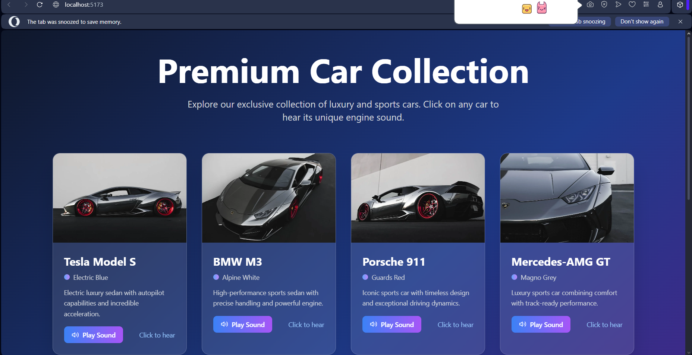

# FEEL THE NOISE 🎯

## Basic Details
### Team Name: [BITSQUAD]

### Team Members
- Team Lead: [ALEN JOBY] - [COLLEGE OF ENGINEERING POONJAR]
- Member 2: [AKSHAI MURALI] - [COLLEGE OF ENGINEERING POONJAR]
- Member 3: [ALEN JOBY] - [COLLEGE OF ENGINEERING POONJAR]

### Project Description
A revolutionary, absolutely unnecessary device that translates ambient noise into physical vibrations and dramatic light shows, allowing you to “feel” your neighbor’s blender, your dog’s snore, or your roommate’s emotional K-pop marathon — whether you like it or not.

### The Problem (that doesn't exist)
People can hear noise of engine, but can they truly feel it?
We live in a society where sound waves are tragically underutilized. Why let your ears have all the fun when your skin, spine, and soul could be involved too?

### The Solution (that nobody asked for)
We built a system that:

Records real engine noises (or steals them from YouTube).

Processes them into “vibration patterns” using questionable math.

Sends those patterns to vibration motors hidden in a seat cushion.

Lights up an RGB LED strip in sync with the revs, so your eyes can suffer too.
## Technical Details
### Technologies/Components Used
For Software:
- For Software:

Languages: Python, Arduino C++

Frameworks: Flask (for a pointless web UI), Arduino framework

Libraries: PyAudio, FastLED, NumPy, Matplotlib (for graphs no one understands)

Tools: VS Code, GitHub, Audacity

For Hardware:
- Main Components: Arduino Nano, MAX9814 microphone, WS2812B LEDs, 12V vibration motors, motor driver module

Specifications:

Vibration speed: Adjustable from “idling” to “dentist drill”

LEDs: 60 per meter, retina-melting brightness

Microphone: Picks up engine sounds up to 20m away (or through walls, awkwardly)

Tools Required: Soldering iron, zip ties, duct tape, WD-40 (for realism)
### Implementation
For Software:
# Installation

# Run
[commands]

### Project Documentation
For Software:

# Screenshots (Add at least 3)

*Add caption explaining what this shows*

*Add caption explaining what this shows*

# Diagrams

*Add caption explaining your workflow*

For Hardware:

# Schematic & Circuit

*Add caption explaining connections*

*Add caption explaining the schematic*

# Build Photos

*List out all components shown*

*Explain the build steps*

*Explain the final build*

### Project Demo
# Video
[Add your demo video link here]
*Explain what the video demonstrates*

# Additional Demos
[Add any extra demo materials/links]

## Team Contributions
- [Name 1]: [Specific contributions]
- [Name 2]: [Specific contributions]
- [Name 3]: [Specific contributions]

---
Made with ❤️ at TinkerHub Useless Projects 

